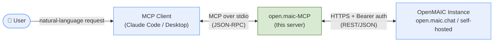
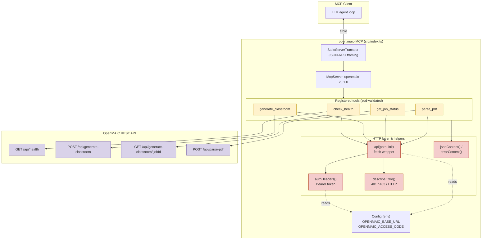
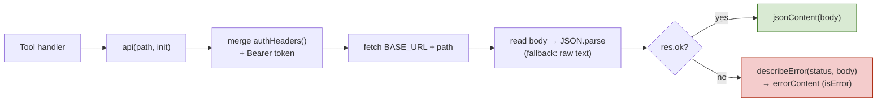
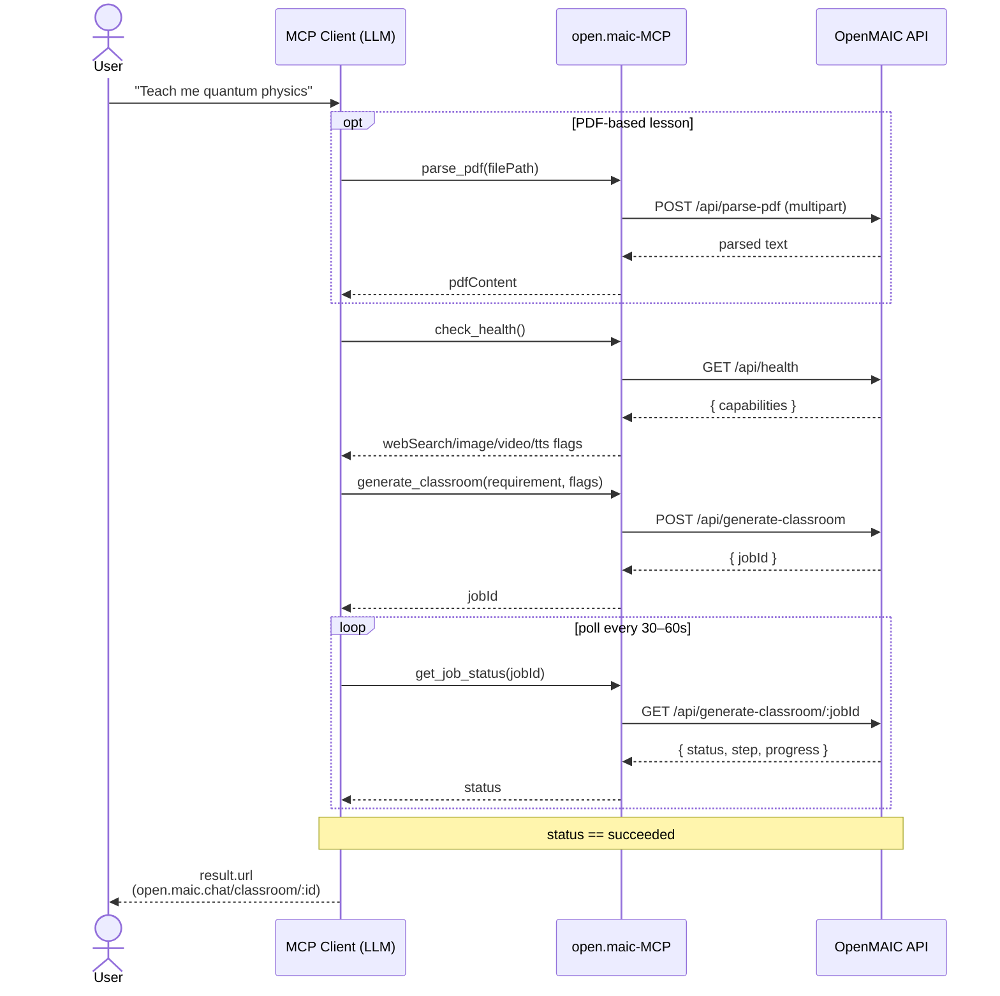

# open.maic-MCP — Architecture

MCP (Model Context Protocol) server that exposes the **OpenMAIC** classroom-generation
API ([open.maic.chat](https://open.maic.chat/), or any self-hosted instance) as a set of
tools usable from any MCP client (Claude Code, Claude Desktop, etc.).

- **Transport:** stdio (`StdioServerTransport`)
- **SDK:** `@modelcontextprotocol/sdk` + `zod` for input schemas
- **Runtime:** Node.js ≥ 20 (uses global `fetch` / `FormData` / `Blob`)
- **Entry point:** [src/index.ts](src/index.ts) → `dist/index.js`

---

## 1. System Context (C4 — Level 1)

---

## 2. Container / Component View

### Tool → endpoint mapping

| MCP Tool | HTTP call | Purpose |
|----------|-----------|---------|
| `check_health` | `GET /api/health` | Connectivity/auth check + capability flags (`webSearch`, `imageGeneration`, `videoGeneration`, `tts`) |
| `generate_classroom` | `POST /api/generate-classroom` | Submit async job; returns `jobId` |
| `get_job_status` | `GET /api/generate-classroom/:jobId` | Poll `queued → running → succeeded/failed`; returns `result.url` |
| `parse_pdf` | `POST /api/parse-pdf` (multipart) | Reads local PDF, uploads as `Blob`, returns parsed text |

---

## 3. Request Pipeline (every tool call)

---

## 4. Typical End-to-End Flow

---

## 5. Cross-cutting concerns

- **Auth:** `OPENMAIC_ACCESS_CODE` (starts with `sk-`) sent as `Authorization: Bearer <code>`
  on every request via `authHeaders()`. Optional for self-hosted instances.
- **Config:** `OPENMAIC_BASE_URL` (default `https://open.maic.chat`); trailing slashes stripped.
- **Error mapping** (`describeError`):
  - `401` → invalid/missing access code
  - `403` → daily quota exhausted (hosted: 10 generations/day, resets midnight)
  - other → `HTTP <status>: <detail>`
- **Async contract:** generation is long-running — submit once, then poll; never resubmit on a failed poll.
- **Stateless:** the server holds no session state; each tool call is an independent HTTP request.
